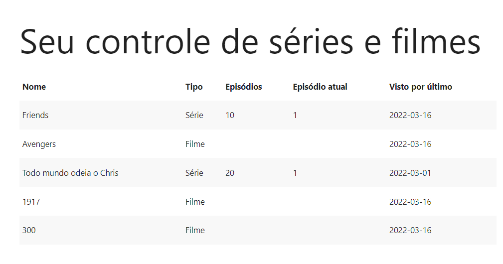

<div align="center" id="top"> 
  

  &#xa0;

  <!-- <a href="https://controledeseriesefilmes.netlify.com">Demo</a> -->
</div>

<h1 align="center">Modelando um banco de controle de séries assistidas</h1>

<p align="center">
  

  

  

  

  <!--  -->

  <!--  -->

  <!--  -->
</p>

<!-- Status -->

<!-- <h4 align="center"> 
	🚧  Controle De Series e Filmes 🚀 Em construção...  🚧
</h4> 

<hr> -->

<p align="center">
  <a href="#dart-sobre">Sobre</a> &#xa0; | &#xa0; 
  <a href="#sparkles-funcionalidades">Funcionalidades</a> &#xa0; | &#xa0;
  <a href="#rocket-tecnologias">Tecnologias</a> &#xa0; | &#xa0;
  <a href="#white_check_mark-pré-requisitos">Pré requisitos</a> &#xa0; | &#xa0;
  <a href="#checkered_flag-começando">Começando</a> &#xa0; | &#xa0;
  <a href="#memo-licença">Licença</a> &#xa0; | &#xa0;
  <a href="https://github.com/isabellazramos" target="_blank">Autor</a>
</p>

<br>

## :dart: Sobre ##

Este repositório contém uma aplicação de controle de séries e filmes com o objetivo de treinar e aperfeiçoar modelagem de banco de dados. Esta aplicação foi construída com o auxílio de Nathally Souza no projeto "MySql - Como modelar um banco de controle de séries assistidas".

## :sparkles: Funcionalidades ##

:heavy_check_mark: Visualizar as séries e filmes presentes no banco de dados;

## :rocket: Tecnologias ##

As seguintes ferramentas foram usadas na construção do projeto:

- [Node.js](https://nodejs.org/en/)
- [React](https://pt-br.reactjs.org/)
- SQL
- PhpMyAdmin

## :white_check_mark: Pré requisitos ##

Antes de começar :checkered_flag:, você precisa ter o [Git](https://git-scm.com), o [Node](https://nodejs.org/en/), SQL e algum SGBD instalados em sua máquina.

## :checkered_flag: Começando ##

```bash
# Clone este repositório
$ git clone https://github.com/isabellazramos/controle-de-series-e-filmes

# Entre na pasta
$ cd controle-de-series-e-filmes

# Instale as dependências no front e no backend
$ yarn

# Para iniciar o projeto
$ yarn start

# O app vai inicializar em <http://localhost:3000> no front e <http://localhost:5000> no back.
```

## :memo: Licença ##

Este projeto está sob licença MIT. Veja o arquivo [LICENSE](LICENSE.md) para mais detalhes.


Feito com :heart: por <a href="https://github.com/isabellazramos" target="_blank">Isabella M. Ramos</a>

&#xa0;

<a href="#top">Voltar para o topo</a>
